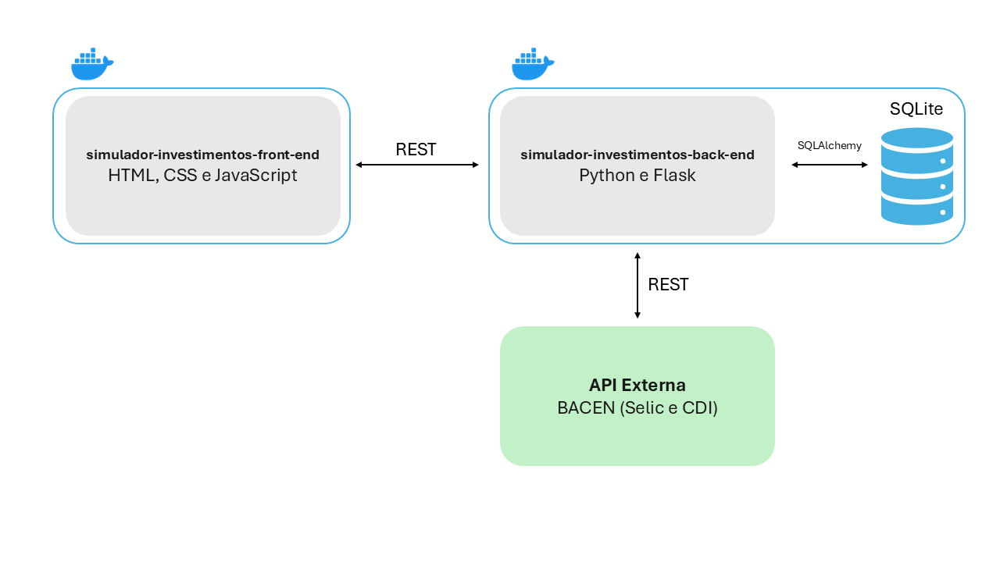

# Simulador de Investimentos (Front-end)
### Por Paulo Henrique Raiol

Este projeto de front-end compõe a entrega do MVP da sprint de Arquitetura de Software do Curso de Engenharia de Software da PUC-Rio.

O objetivo deste projeto é a **realização do cálculo de rentabilidade futura** de investimentos em renda fixa com evolução mensal. Utilizando variáveis como aporte inicial, aporte mensal, escolher taxas reais de mercado (Selic ou CDI acumulado nos 12 meses), prazo em meses ou anos e estimativa de gastos mensais.

Ele retorna o valor final, total investido e total de juros ganhos. Também análises adicionais como percentual de juros em relação ao investido, cobertura de gastos mensais utilizando o investimento, cálculo de renda passiva com base na taxa de juros informada, equivalência dos juros recebidos em relação ao aporte mensal.

## 🚀 Funcionalidades da interface
- **Dashboard Interativo:** Inputs dinâmicos para simulação.
- **Integração em Tempo Real:** Listagem automática das taxas de juros atuais.
- **Visualização de Dados:** Tabelas de evolução mensal e cards de resumo financeiro.
- **CRUD Local:** Funcionalidade para salvar, editar e excluir simulações (Persistência no SQLite).

## 📐 Arquitetura da aplicação


## 🌐 APIs Externas Utilizadas
O sistema consome dados reais e atualizados diretamente do **Portal de Dados Abertos do Banco Central do Brasil (BACEN)**. O serviço é público, gratuito e não requer autenticação (chave de API).  
A integração é orquestrada pelo Back-end, mas os dados refletem diretamente na experiência do usuário no Front-end (preenchimento automático do select de taxas).

**Meta Selic**  
Código da série: 432  
Descrição / Uso no Projeto: Retorna a taxa de juros Meta Selic definida pelo COPOM. Utilizada para preencher a taxa padrão de simulação.  
Rota da API (Endpoint): `https://api.bcb.gov.br/dados/serie/bcdata.sgs.432/dados/ultimos/1?formato=json`

**CDI (12m)**  
Código da série: 4391  
Descrição / Uso no Projeto: Retorna o histórico recente do CDI mensal. O sistema consome os últimos 12 meses para calcular a taxa acumulada real.  
Rota da API (Endpoint): `https://api.bcb.gov.br/dados/serie/bcdata.sgs.4391/dados/ultimos/12?formato=json`

> **Nota de Licença:** Os dados são disponibilizados pelo Governo Federal sob a Política de Dados Abertos do Poder Executivo Federal (Decreto nº 8.777/2016).

## 🐳 Como executar com Docker (Recomendado)

Este repositório contém o arquivo `docker-compose.yml` responsável por orquestrar tanto o Front-end quanto o Back-end.

### 1. Pré-requisitos
- Docker e Docker Compose instalados na máquina.

### 2. Estrutura de Pastas (Importante)
Para que o Docker encontre os arquivos corretamente, clone este repositório e o repositório do back-end **lado a lado** em uma mesma pasta pai, mantendo EXATAMENTE os nomes abaixo:

```text
MinhaPasta/
├── simulador-investimentos-back-end/  <-- Repositório da API clonado
└── simulador-investimentos-front-end/ <-- Este repositório (Você está aqui)
    ├── docker-compose.yml
    ├── index.html
    └── ...
```

### 3. Passo a Passo
1. Abra o terminal dentro da pasta `simulador-investimentos-front-end`.
2. Execute o comando para construir e subir os containers:
```bash
docker compose up --build
```
3. Aguarde os logs de inicialização.
4. Acesse a aplicação no navegador:
    - Frontend: http://localhost:8080
    - Backend (API): Rodando em segundo plano na porta 5000.

## 🛠️ Execução Manual (Sem Docker)
Se preferir rodar sem containers:
1. Certifique-se de que o Back-end já esteja rodando na porta 5000 (veja instruções no repositório do back-end).
2. Basta abrir o arquivo `index.html` diretamente em seu navegador (ou usar uma extensão como Live Server).

Nota: A aplicação espera que a API esteja acessível em http://localhost:5000.

